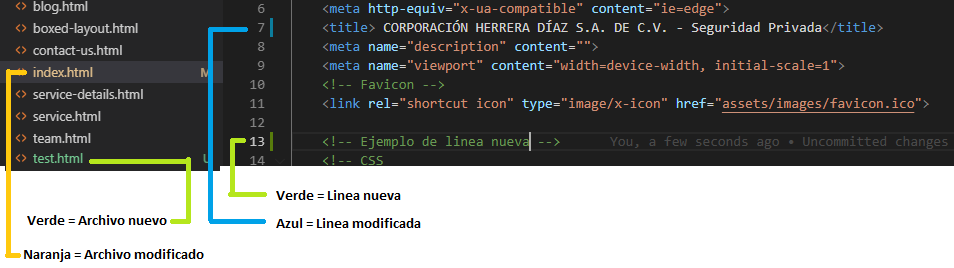

# CORHDSA.project

Vive en Vallarta Bienes Raíces. Pagina Web

## Requisitos

-   [composer](https://getcomposer.org/download/)

-   [VSCode.zip](https://code.visualstudio.com/Download)

    Instalar extensiones:

    -   Auto Close Tag
    -   Auto Rename Tag
    -   Git Lens
    -   IntelliSense for CSS class names in HTML
    -   IntelliJ IDEA Keybindings

-   [Git](https://git-scm.com/download/win)

## ¿Como subir cambios a este repositorio?

-   Si es la primera vez que se instala Git en la PC, se debe especificar el correo del usuario, el el menu Terminal > New Terminal ingresar el siguiente comando:

    ```shell
    git config --global user.email <mi-email>
    ```

-   Lo siguiente que se debe hacer es clonar el repositorio en la PC abriendo la consola en ingresando lo siguiente:

    ```shell
    git clone https://github.com/dviluk/CORHDSA.git
    ```

-   Una vez clonado abrimos el proyecto con el editor de texto y hacemos los cambios necesarios

<div style="text-center">

</div>

-   Una vez terminados los cambios se deben subir a este repositorio utilizando los comandos

    ```shell
    git add .                               # significa agregar todos los cambios que hice
    git commit -m "Cambios de Ejemplo"      # almacenas los cambios y describes que es lo que estas haciendo (-m = mensaje)
    git push origin master                  # los cambios se suben a este repositorio
    # si se tiene problemas al subir los cambios, lo mas seguro es que se deba a que hay
    # nuevos cambios en el repositorio que no se tienen en el proyecto local, asi que se
    # debe descargar primero los cambios con:
    git pull origin master
    # despues de haber descargado los cambios ahora si podras continuar con:
    git push origin master
    ```

## Instalacion

Una vez descargado, se debe ejecutar el comando `composer install`
